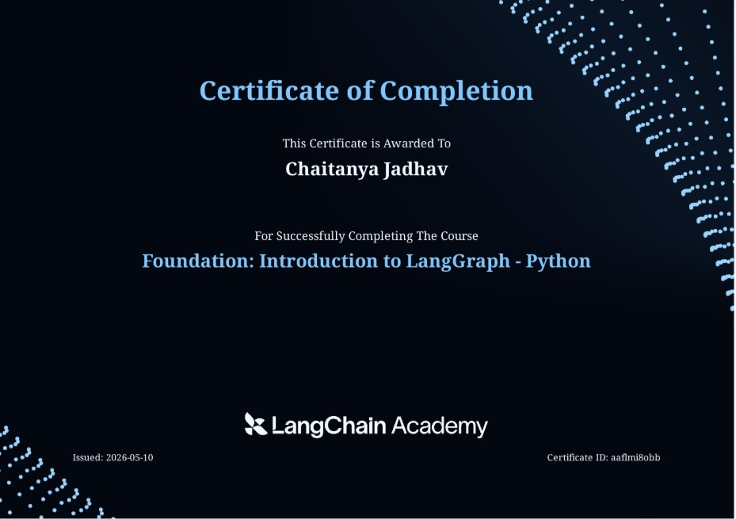
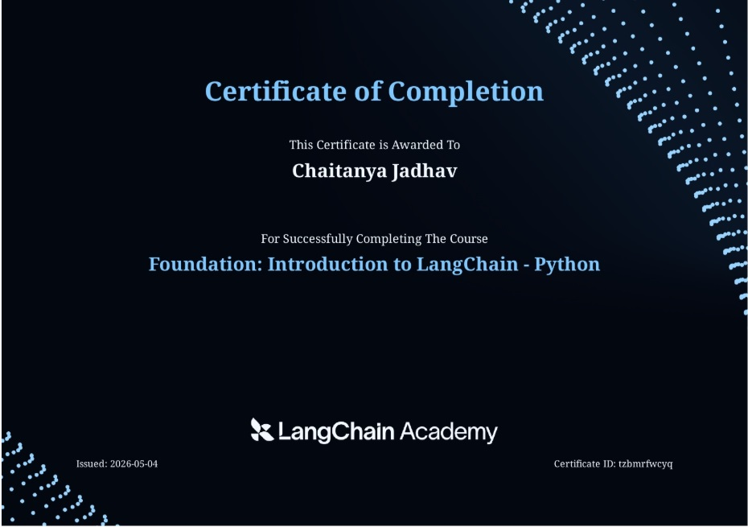

# Academy LangChain & LangGraph

A comprehensive learning repository covering production-grade patterns for building AI agents with **LangChain** and **LangGraph**, based on [academy.langchain.com](https://academy.langchain.com).

---

## What's Implemented

### `project_langchain/` — Core LangChain Patterns

| Module | Description |
|--------|-------------|
| `agent_initialization.py` | Agent creation with `create_agent()`, system prompts, tool binding |
| `tools.py` | Tool definition using the `@tool` decorator, custom tool schemas |
| `memory.py` | Short-term in-memory state persistence with `InMemorySaver` and `thread_id` |
| `human_in_the_loop.py` | Human approval workflows using `HumanInTheLoopMiddleware` and `Command(resume=...)` |
| `prompting.py` | Prompt engineering — system messages, templates, few-shot examples |
| `streaming_output.py` | Real-time LLM response streaming |
| `streaming_output_with_events.py` | Streaming with LangChain event callbacks |
| `models_initialization_ways.py` | `init_chat_model()` vs `ChatOpenAI()` — model abstraction patterns |
| `runtime_context.py` | Passing runtime config and context to agents |
| `multimodal_messages.py` | Sending images and mixed-media messages to LLMs |
| `summarize_messages.py` | Trimming and summarizing message history to manage context |
| `personal_chef.py` | End-to-end example agent with tools and memory |
| `langchain_multi_agent.py` | Multi-agent orchestration patterns comparison |
| `connect_local_mcp_server.py` | Connecting to a local MCP (Model Context Protocol) server |
| `connect_online_mcp_server.py` | Connecting to a remote MCP server |
| `resources/mcp_server.py` | A local MCP server exposing tools over the protocol |

#### `project_langchain/project_wedding_planner/` — Multi-Agent Orchestration Project

A complete multi-agent system demonstrating prompt-driven orchestration. A coordinator agent delegates tasks to specialist sub-agents:

- **`main.py`** — Entry point; coordinator agent with a structured system prompt
- **`agents.py`** — Specialist agents: `search_flights`, `search_venues`, `suggest_playlist`, `update_state`
- **`tools.py`** — Tools available to each specialist agent
- **`state.py`** — Shared `WeddingState` schema passed across agents
- **`mcp_client.py`** — MCP client integration for tool discovery

---

### `project_langgraph/` — LangGraph Graph-Based Agents (Current Best Practice)

Each file is a self-contained, runnable example of a specific LangGraph pattern.

| Module | Pattern | Key Concepts |
|--------|---------|--------------|
| `simple_graph.py` | Basic workflow | `StateGraph`, `TypedDict` state, `Literal` routing |
| `state_schema.py` | State design | TypedDict vs dataclass vs Pydantic comparison |
| `state_reducer.py` | State reducers | `Annotated` with `operator.add` for accumulation |
| `multiple_schema.py` | Multi-schema graphs | Input/output schema separation |
| `messages_state_example.py` | Message state | `MessagesState`, message threading |
| `agent_langraph.py` | Tool-using agent | `ToolNode`, `tools_condition`, `llm.bind_tools()` |
| `routing_with_ToolNode.py` | Tool routing | Conditional edges with tool execution |
| `agent_with_memory.py` | Short-term memory | `MemorySaver`, `thread_id` config, `get_state()` |
| `parallelization.py` | Parallel nodes | Multiple edges from `START`, concurrent execution |
| `map_reduce.py` | MapReduce | `Send()` for dynamic fan-out, `operator.add` fan-in |
| `message_summarization.py` | Context management | Auto-summarize messages to reduce token usage |
| `remove_state_messages.py` | Message pruning | Selective removal of messages from state |
| `llm_output_streaming_langgraph.py` | Streaming | Real-time output from LangGraph agents |
| `human_in_the_loop_breakpoint.py` | Human-in-the-loop | `interrupt()` breakpoints, `Command(resume=...)` |
| `edit_state_human_feedback.py` | State editing | Modifying graph state mid-execution for human feedback |
| `sub_graph_summarize_logs_and_find_failure.py` | Subgraphs | Composing child graphs within a parent graph |
| `longterm_memory_langgraph_store.py` | Long-term memory | `PostgresStore`, namespace-based persistent memory |
| `research_assistant_project.py` | Complex multi-agent | Multi-analyst research workflow with structured output |

---

### `db/` — PostgreSQL Database Layer

Centralized PostgreSQL integration for production-grade LangGraph persistence.

| Component | Purpose |
|-----------|---------|
| `PostgresStore` | Long-term memory store — persists data beyond a single thread |
| `PostgresSaver` | Thread checkpointer — enables resumable, fault-tolerant agents |
| `ConnectionPool` | Shared connection pool (max 20 connections, autocommit) |
| `init_db()` | Creates required LangGraph tables on startup |
| `close_db()` | Gracefully shuts down all connections |

---

## Architecture Overview

### LangChain vs LangGraph

The repo deliberately contrasts two eras:

| | Classic LangChain Agents | LangGraph (Recommended) |
|---|---|---|
| Control flow | Hidden inside the framework | Explicit state machine you define |
| State | Opaque | Typed, inspectable, editable |
| Debugging | Limited | Full graph visualization + step replay |
| Human-in-the-loop | Hard to add | First-class `interrupt()` support |
| Production readiness | Limited | PostgreSQL checkpointing + store |

### Orchestration Patterns (from `project_wedding_planner/main.py`)

| Approach | Control | Production-readiness |
|----------|---------|----------------------|
| Prompt-driven | Low | ❌ |
| Router / Intent-based | Medium | ✅ |
| Planner–Executor | High | ✅✅ |
| State machine | Very High | ✅✅✅ |
| **Graph-based** | Very High | **✅✅✅ (current best practice)** |
| Multi-agent | Medium | ⚠️ |
| Event-driven | Very High | ✅✅✅ |

### LangGraph State Schema Options

```python
# 1. TypedDict — default choice, lightweight, supports reducers
class MyState(TypedDict):
    messages: list
    results: Annotated[list, operator.add]  # accumulator reducer

# 2. MessagesState — for agent/tool workflows with message threading
class MyState(MessagesState):
    extra_field: str

# 3. Pydantic — for runtime validation and external inputs
class MyState(BaseModel):
    name: str
    mood: Literal["happy", "sad"]
```

### Standard Graph Construction Pattern

```python
from langgraph.graph import StateGraph, START, END

graph = StateGraph(MyState)
graph.add_node("node_name", node_function)
graph.add_edge(START, "node_name")
graph.add_conditional_edges("node_name", routing_function)
graph.add_edge("node_name", END)

app = graph.compile(checkpointer=checkpointer, store=store)

# Always pass config with thread_id
config = {"configurable": {"thread_id": "session-1"}}
result = app.invoke({"messages": [HumanMessage(content="Hello")]}, config)
```

---

## Prerequisites

- Python 3.12+
- [`uv`](https://docs.astral.sh/uv/) package manager
- PostgreSQL (only required for `longterm_memory_langgraph_store.py` and `db/` modules)

---

## Setup

```bash
# 1. Clone the repo
git clone https://github.com/chaitanya-jadhav11/academy-langchain-langgraph.git
cd academy-langchain-langgraph

# 2. Install dependencies
uv sync

# 3. Configure environment variables
cp .env.example .env
# Edit .env with your API keys
```

### Environment Variables

```bash
# Required
OPENAI_API_KEY=your_openai_api_key

# Required for web search tools
TAVILY_API_KEY=your_tavily_api_key

# Optional — for Claude model support
ANTHROPIC_API_KEY=your_anthropic_api_key

# Optional — for tracing and evaluation
LANGSMITH_API_KEY=your_langsmith_api_key
LANGSMITH_PROJECT=lca-lc-foundation
# LANGSMITH_TRACING=true
```

### PostgreSQL Setup (optional)

Required only for `longterm_memory_langgraph_store.py` and any module importing `db/db.py`.

```bash
# Create the database
createdb langgraph_db

# Update DATABASE_URL in db/db.py with your credentials
# postgresql://postgres:<password>@localhost:5432/langgraph_db
```

---

## Running Examples

```bash
# LangChain examples
uv run -m project_langchain.agent_initialization
uv run -m project_langchain.tools
uv run -m project_langchain.memory
uv run -m project_langchain.human_in_the_loop
uv run -m project_langchain.streaming_output

# Multi-agent wedding planner project
uv run -m project_langchain.project_wedding_planner.main

# LangGraph examples
uv run -m project_langgraph.simple_graph
uv run -m project_langgraph.agent_langraph
uv run -m project_langgraph.agent_with_memory
uv run -m project_langgraph.map_reduce
uv run -m project_langgraph.parallelization
uv run -m project_langgraph.human_in_the_loop_breakpoint
uv run -m project_langgraph.research_assistant_project

# Long-term memory (requires PostgreSQL)
uv run -m project_langgraph.longterm_memory_langgraph_store
```

---

## Debugging & Observability

**Graph visualization:**
```python
# Print ASCII graph to console
app.get_graph().print_ascii()

# Save Mermaid diagram as PNG
app.get_graph().draw_mermaid_png(output_file_path="graph.png")
```

**LangSmith tracing** is enabled automatically when `LANGSMITH_API_KEY` is set in `.env`. Tag traces for easy filtering:
```python
config = {"tags": ["my-experiment"], "recursion_limit": 40}
```

**Inspect agent state mid-run:**
```python
snapshot = app.get_state(config)
print(snapshot.values)
print(snapshot.next)  # which node runs next
```

---

## Key Dependencies

| Package | Purpose |
|---------|---------|
| `langchain` | Core framework — agents, chains, tools |
| `langgraph` | Graph-based agent orchestration |
| `langchain-openai` | GPT-4o and other OpenAI model integration |
| `langchain-anthropic` | Claude model integration |
| `langchain-tavily` | Web search tool |
| `langgraph-checkpoint-postgres` | PostgreSQL thread state persistence |
| `langchain-mcp-adapters` | MCP (Model Context Protocol) tool integration |
| `langsmith` | Tracing, evaluation, and observability |
| `psycopg` | PostgreSQL async driver |

## Certificate :- 

Course: Foundation: Introduction to LangGraph - Python



Course: Foundation: Introduction to LangChain - Python



